# PHP开源商城

[效果浏览](#浏览效果)
支持秒杀、众筹等功能
# dependence

PHP>=7.2.5\
Elasticsearch 6\
node.js npm\
Mysql Innodb

## 下载
github
````
git clone git@github.com:tanchengjin/shop.git
````

gitee
````
git clone git@gitee.com:TanChengjin/shop.git
````

## 安装

1、docker安装\
进入docker目录执行如下命令进行安装
````
docker-compose up [-d 可选参数用于后台执行]
````

安装依赖包
````
docker exec -it shop-php composer install
````

将.env.docker重命名为.env

生成key
````
docker exec -it shop-php php artisan key:generate
````
配置目录权限
````
docker exec -it shop-php chmod 777 -R storage
````
数据填充
````
docker exec -it shop-php php artisan shop:install
````
启动队列
````
docker exec -it shop-php php artisan queue:work
````
2、普通安装

安装依赖包
````
composer install
````
生成key
````
php artisan key:generate
````

配置目录权限
`确保storage目录有777权限` 

数据填充
````
php artisan shop:install
````

启动队列
````
php artisan queue:work
````

### 使用

后台url\
/admin
````
账号admin
密码admin
````

### 配置
普通安装，将`.env.example`重命名为`.env` \
docker安装，将`.env.docker`重命名为`.env`
- 支付宝\

.env配置\
```
ALI_APP_ID= app id
ALI_PUBLIC_KEY= 公钥
ALI_PRIVATE_KEY= 私钥
```

- 微信

.env配置
````
WECHAT_APP_ID= 公众号 app id
WeCHAT_MCH_ID= 商户号
WeCHAT_KEY= API 密钥
````
配置API证书
`将cert与key文件放入到resource/wechat文件夹下，并在.env下配置`

````
WECHAT_CERT=cert文件完整文件名
WECHAT_CERT_KEY=文件完整文件名
````


# 浏览效果

首页
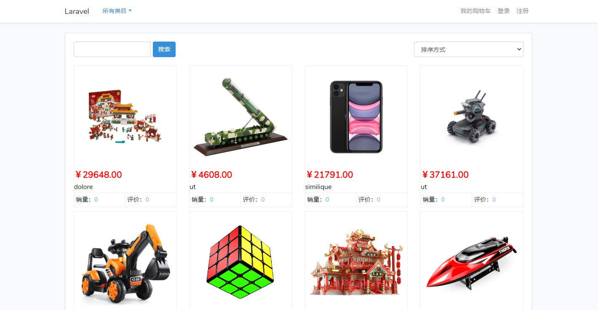
分面导航
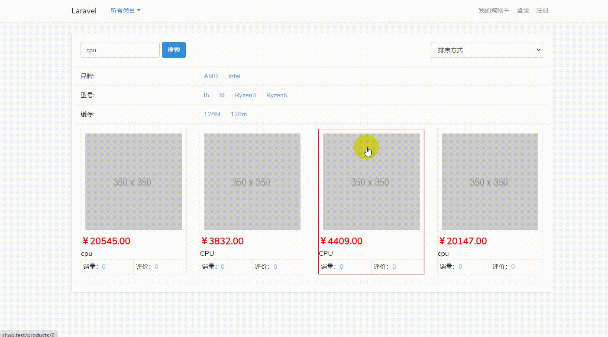
详情页
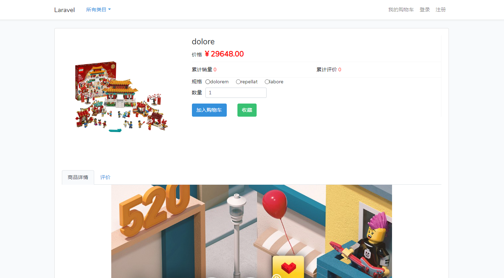

购物车
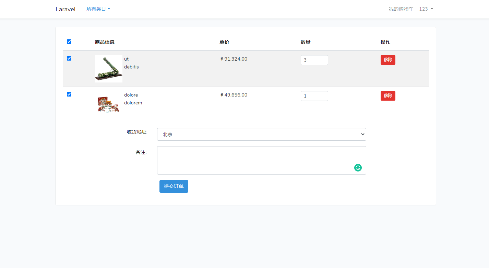

收货地址
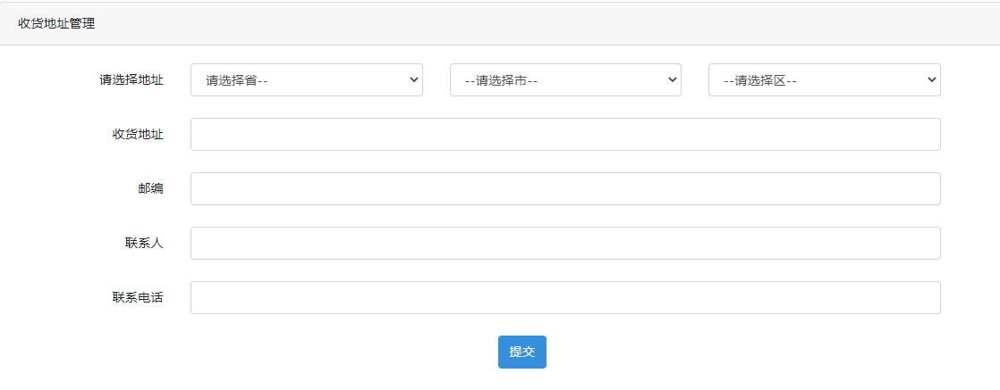
分类
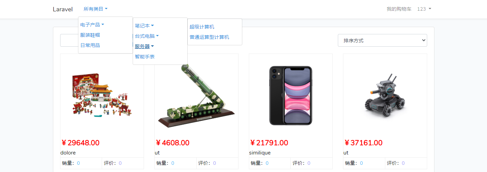

订单

订单支付
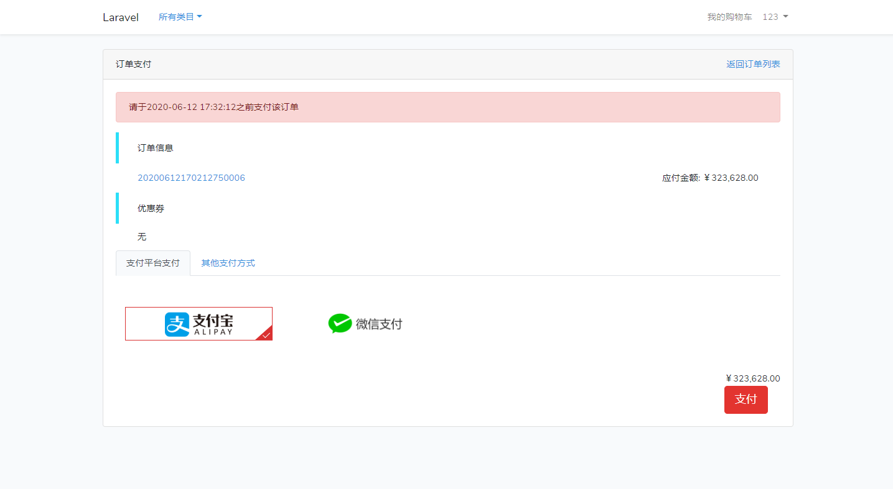
秒杀
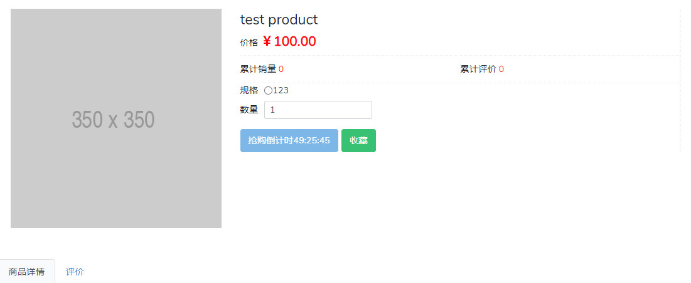
众筹
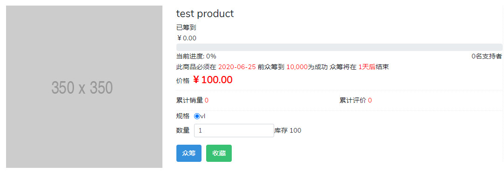
后台，商品、订单、分类、优惠券等
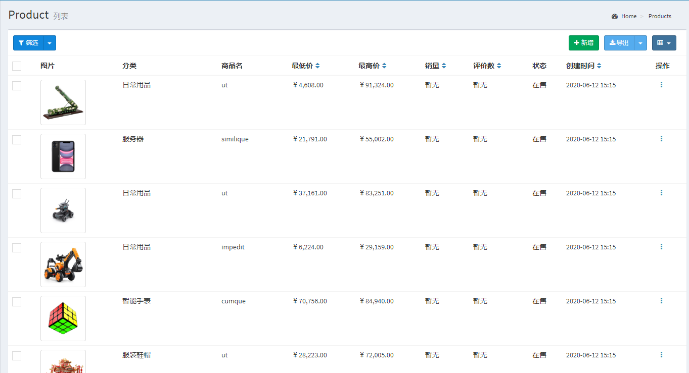
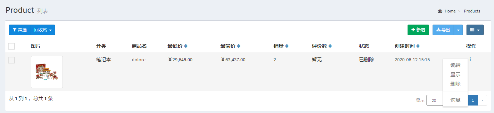
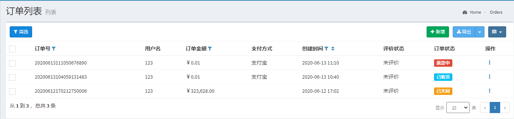
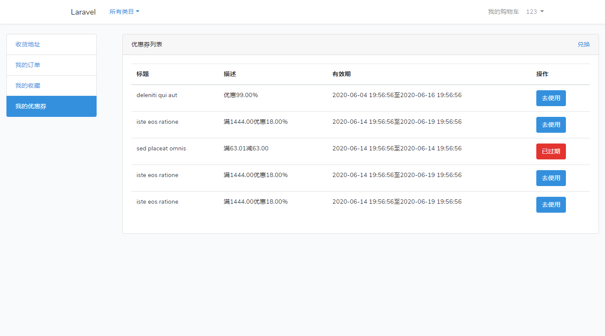


